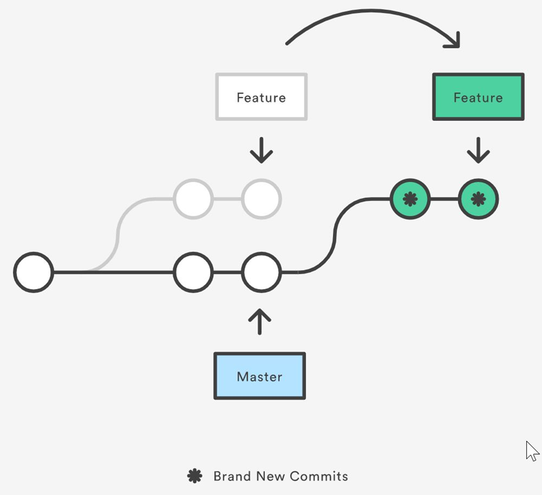

## Level up your Git skills

- How to get good at Git <!-- .element: class="fragment" -->
- How be a git ninja/guru/rockstart <!-- .element: class="fragment" -->
- The Git hero's journey<!-- .element: class="fragment" -->
- Be the git hero your team deserves <!-- .element: class="fragment" -->

---

### About me

- I'm interested/expertise in: <!-- .element: class="fragment" -->
  - UI/UX
  - automated testing
  - dev tooling, git
  - productivity

---

### Mindfully crafted commit messages

---

## Every line of code is documented

- Who added the code?
- When was it added?
- What tests were added with this change?
- What was the associated issue or pull request?
- The commit message can have as much information as needed
- Unlike comments it won’t ever be out of date.

---

## What does a good commit look like?

Taken from [https://commit.style/](https://commit.style/)


---

## What does a good commit look like?

- Should answer “Why?”
- How does it address the issue?
- Are there any potential side effects?
- What issues did you have solve, errors, tradeoffs?

---


```
Short one line title

Longer description of what the change
does (if the title isn’t enough).

An explanation of why the change is
being made.

Perhaps a discussion of context and/or
alternatives that were considered.
```

---

``` markdown
Rename foreign keys for `CustomerOrders`

The foreign keys were the only thing not automatically handled by the EF
migrations scaffolding.
Using `sp_rename` seems to be the recommended approach for renaming
foreign keys in sql server. The standard entity framework approach is to
first call `DropKey` and then `AddKey` but that seems more cumbersome
since you have to specify the table and column as well each time.

Note, I ran into an issue where I was getting a "No item by the name of"
[error][1] for the key which turned out to be because if there is a dot in
the name then it needs to be surrounded with brackets, _but_ if you include
brackets in the new name then it will literally include them as part of
the name. ¯\_(ツ)_/¯

work-item: #123

[1]: https://stackoverflow.com/a/58287867/1715138
```

---

#### TIPS

- Use a .gitmessage [Template](https://www.reinhardt.io/2021/06/03/creating-a-custom-git-commit-template.html)
- Use a git client that highlights proper formatting or supports templates
- Use a git hook to automatically insert ticket number
- Configure git text editor and run `git commit`
  - `git config --global core.editor "code --wait"`
- Avoid `git commit -m "message"`

---

## Git blame


---

## Git pickaxe

* `$ git log --grep='Commit contents'`
* `$ git log -S 'Diff contents'`


---

## Don't be afraid to change history

---

### Rebase is your friend

- Pull with rebase prevents trivial merge commits <!-- .element: class="fragment" -->
- &shy;<!-- .element: class="fragment" --> `git config --global pull.rebase true` 
- Use rebase instead of merge to bring your branch up to date with master for a much cleaner and easier to follow log<!-- .element: class="fragment" -->
- Interactive rebase allows cleaning up your commits by editing messages, combining, splitting, removing, reordering <!-- .element: class="fragment" -->

---


---


---


---

### What is Rebase?



[Explain rebase](https://onlywei.github.io/explain-git-with-d3/#rebase)

---

### Force push considered harmful?

- No, just a really sharp tool
- Forcefully replaces head of branch with your local
- Creates potential to remove commits from branch
- Very hard to actually lose work that’s been committed to git
- Even dangling commits will remain in repo for at least 2 weeks
- Can be used safely if you’re the only one working on a branch
- Can even be used on a shared feature branch if you communicate effectively

---

### Safest way to force push


``` bash
git push --force-with-lease --force-if-includes
```

- Configure branch policies or protected branches <!-- .element: class="fragment" -->

---

### Config settings I always recommend

- `git config --global pull.rebase true`
  - tells git to always pull with rebase instead of merge (the equivalent of `pull --rebase`).

---

- `git config --global fetch.prune true`
- tells git to automatically run `git remote prune` after a `fetch`. This will clean up any local objects that no longer exist on the remote like tracking branches that have been deleted from the remote server.

---

- `git config --global rebase.autoStash true`
- tells git to automatically stash when you perform a pull and then attempt to unstash them once the rebase is complete.

---

- `git config --global rebase.autosquash true`
- tells git to automatically include the `--autosquash` parameter when doing a `git rebase --interactive`. You should [read more about autosquashing](https://thoughtbot.com/blog/autosquashing-git-commits) commits if you're unfamiliar with it. I use it all the time for fixing up or rewording previous commits.

---
- `git config --global --add --bool push.autoSetupRemote true`
---

### Pro tips

- [Work on two branches at once with Git worktree](https://andrewlock.net/working-on-two-git-branches-at-once-with-git-worktree/)
- Branch a feature off of another feature branch (Stacked branches)
  - Use `git rebase --onto <newbase> <oldbase> <newhead>`
- `git reset` is your friend
- Remove latest 3 commits `git reset --keep head~3`
- Reset to what’s on the remote: `git reset --keep origin/my-branch`
- Use build server logs to time travel with your branch
- [--update-refs](https://andrewlock.net/working-with-stacked-branches-in-git-is-easier-with-update-refs/)

---

- Search the reflog: `git log -g --grep=”lost commit message”`
- `--first-parent`
- Make use of rerere: `git config --global rerere.enabled true`

---

### Tools

- [Git absorb](https://andrewlock.net/super-charging-git-rebase-with-git-absorb/)
- [git-filter-repo](https://andrewlock.net/rewriting-git-history-simply-with-git-filter-repo/)
- [git-when-merged](https://github.com/mhagger/git-when-merged) - determine merge commit of a particular commit

---

### Aliases

- Make use of aliases
  - `rem = !git fetch && git rebase origin/main`
  - `git config --global alias.cm checkout main && pull`
  - Wipe: `wipe = !git add -A && git commit -qm 'WIPE SAVEPOINT' && git reset HEAD~1 --hard`

---

## Automate standards enforcement

---

### Git hooks

Client side hooks

- applypatch-msg
- post-applypatch
- pre-applypatch
- pre-commit
- prepare-commit-msg
- commit-msg
- post-commit
- post-checkout

---

### Pre-commit hook

- Linting
- Spell checking
- Auto format code -> Prettier, Dotnet format, Resharper cli
- Catch silly mistakes
- Enforce commit message requirements
- Can be run only on files/lines that changed
- Faster feedback
- Avoids having to fix a commit after a build failure

---

### Remote branch policies

- Protect against force push
- Require pull requests to commit to main branch
- Protect against deletions

---

### What’s next? Start reading and practicing!

- [Deliberate git](http://www.rakeroutes.com/blog/deliberate-git/)
- [Git practice problems](https://github.com/praqma-training/git-katas)
- [Git from the inside out](https://codewords.recurse.com/issues/two/git-from-the-inside-out)
- [Flight rules for git](https://github.com/k88hudson/git-flight-rules)
- Git log spelunking: https://mislav.net/2014/02/hidden-documentation/
- My favorite git client: [SmartGit](https://www.syntevo.com/smartgit/)
- [Git extension](https://gitextensions.github.io/) - a powerful free client
- [Getting out of trouble by understanding Git](https://www.youtube.com/watch?v=sevc6668cQ0)

<style>
.reveal pre code {
  max-height: 600px;
}
.reveal pre.code-wrapper {
  width: unset;
}

body {
  /* --r-background-color: #460073; */
}
.reveal li > code {
  font-family: Monaco,Menlo,Consolas,Courier New,monospace!important;
  color: #e8912d; /* maybe #569cd6 to match VS blue */
  padding: 2px 3px 1px;
  border: 1px solid rgb(34, 63, 80);
  border-radius: 3px;
  --sk_foreground_min: 232,232,232;
  background-color: rgba(var(--sk_foreground_min,29,28,29),.04);
}
</style>
