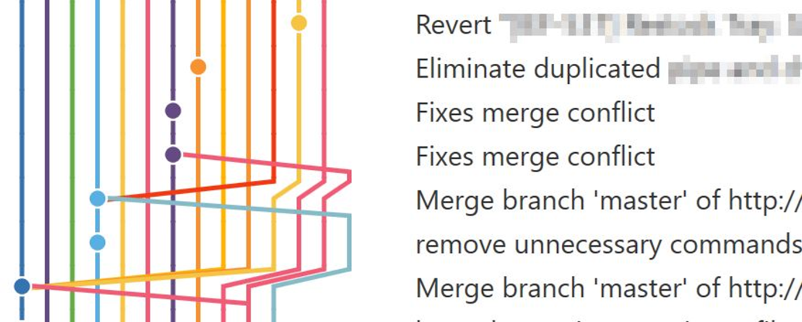

## Level up your Git skills

---

### About me

- I'm interested/expertise in: <!-- .element: class="fragment" -->
  - UI/UX
  - automated testing
  - dev tooling, git
  - productivity

---

### Mindfully crafted commit messages

---

## Every line of code is documented

- Who added the code?
- When was it added?
- What tests were added with this change?
- What was the associated issue or pull request?
- The commit message can have as much information as needed
- Unlike comments it won’t ever be out of date.

---

## What does a good commit look like?

Taken from [https://commit.style/](https://commit.style/)

---

## What does a good commit look like?

- Should answer “Why?”
- How does it address the issue?
- Are there any potential side effects?

#### TIPS

- Use a .gitmessage Template
- Use a git client that highlights proper formatting or supports templates
- Use a git hook to automatically insert ticket number
- Configure git text editor and run `git commit`
- Avoid `git commit -m "message"`

---

---

## Don't be afraid to change history

---

### Rebase is your friend

- Interactive rebase allows cleaning up your commits by editing messages, combining, splitting, removing, reordering
- Pull with rebase prevents trivial merge commits
- Use rebase instead of merge to bring your branch up to date with master for a much cleaner and easier to follow

---

---

---

### What is Rebase?

[Explain rebase](https://onlywei.github.io/explain-git-with-d3/#rebase)

---

### Force push considered harmful?

- No, just a really sharp tool
- Forcefully replaces head of branch with your local
- Creates potential to remove commits from branch
- Very hard to actually lose work that’s been committed to git
- Even dangling commits will remain in repo for at least 2 weeks
- Can be used safely if you’re the only one working on a branch
- Can even be used on a shared feature branch if you communicate effectively
- Use `git push --force-with-lease`

---

### Pro tips

- Make use of rerere: `git config --global rerere.enabled true`
- Branch a feature off of another feature branch
  - Use `git rebase --onto <newbase> <oldbase> <newhead>`
- `git reset` is your friend
- Remove latest 3 commits `git reset --keep head~3`
- Reset to what’s on the remote: `git reset --hard origin/my-branch`
- Use build server logs to time travel with your branch
- Search the reflog: `git log -g --grep=”lost commit message”`
- Make use of aliases
  - `git config --global alias.cm checkout master && pull`
  - Wipe: `wipe = !git add -A && git commit -qm 'WIPE SAVEPOINT' && git reset HEAD~1 --hard`

---

## Automate standards enforcement

---

### Git hooks

Client side hooks

- applypatch-msg
- post-applypatch
- pre-applypatch
- pre-commit
- prepare-commit-msg
- commit-msg
- post-commit
- post-checkout

---

### Pre-commit hook

- Linting
- Spell checking
- Auto format code -> Prettier, Dotnet format, Resharper cli
- Catch silly mistakes
- Enforce commit message requirements
- Can be run only on files/lines that changed
- Faster feedback
- Avoids having to fix a commit after a build failure

---

### Remote branch policies

- Protect against force push
- Require pull requests to commit to main branch
- Protect against deletions

---

### What’s next? Start reading and practicing!

- [Deliberate git](http://www.rakeroutes.com/blog/deliberate-git/)
- [Git practice problems](https://github.com/praqma-training/git-katas)
- [Git from the inside out](https://codewords.recurse.com/issues/two/git-from-the-inside-out)
- [Flight rules for git](https://github.com/k88hudson/git-flight-rules)
- Git log spelunking: https://mislav.net/2014/02/hidden-documentation/
- My favorite git client: [SmartGit](https://www.syntevo.com/smartgit/)
- [Getting out of trouble by understanding Git](https://www.youtube.com/watch?v=sevc6668cQ0)

